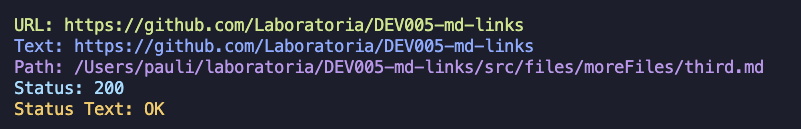

# Markdown Links

## Índice

* [1. Preámbulo](#1-preámbulo)
* [2. Librería md-pauli](#2-Librería-md-pauli)
* [3. Instalación y uso](#3-instalación-y-uso)
* [4. Planificación del Proyecto](#4-planificación-del-proyecto)
* [5. Diagrama de flujo](#5-Diagrama-de-flujo)
***

## 1. Preámbulo

[Markdown](https://es.wikipedia.org/wiki/Markdown) es un lenguaje de marcado
ligero muy popular entre developers. Es usado en muchísimas plataformas que
manejan texto plano (GitHub, foros, blogs, ...) y es muy común
encontrar varios archivos en ese formato en cualquier tipo de repositorio
(empezando por el tradicional `README.md`).

Estos archivos `Markdown` normalmente contienen _links_ (vínculos/ligas) que
muchas veces están rotos o ya no son válidos y eso perjudica mucho el valor de
la información que se quiere compartir.

Esta librería tiene como finalidad leer y analizar archivos
en formato `Markdown`, y  verificar los links que contengan, reportando estadísticas de ellos

## 2. Librería md-pauli

Esta librería es una herramienta  de línea de comando (CLI), que utiliza JavaScript, está costruída en Node.js y utiliza CommonJS Modules.

### Funcionamiento de la librería

El análisis de los archivos markdown, se realiza a través de la libería marked, luego se utiliza la librería JSDOM para extraer los links y axios para conocer el estado de los links. Finalmente con la librería colors, se presentan los resultados al usuario en pantalla.

## 3. Instalación y Uso

### Instalación

Para instalar este  módulo, se ejecuta la siguiente línea de comandos.

`npm install paulivega/DEV005-md-links` 

### Uso desde la línea de comando

Este módulo se utiliza directamente desde la línea de comandos, colocando el nombre de la librería y luego la ruta del archivo o directorio a revisar.

`md-pauli <ruta o path>` 

### Opciones de validación

Por defecto, md-pauli entregará en consola la siguiente información de los links encontrado en los archivos .md

URL  = la dirección de link encontrado.
Text = el texto que aparece deentro del link encontrado (truncado a 50 caracteres).
Path = ruta del archivo .md

Además puedes agregar la opción --validate, opción que  entrega además de links encontrados, el status (200 o 400) y el status text.

También puedes utilizar la opción --stats, la cual entrega información respecto al total de links encontrados y únicos.

Por último, en el caso de combinar ambas opciones, --validate y --stats, se muestran en pantalla el total de links, únicos y broken(rotos).

## 4. Planificación del proyecto
Para este proyecto, se crearon milestones e issues para las diferentes tareas y procesos de desarrollo del proyecto.
Puedes revisarlo en el siguiente link [Milestones]([Markdown](https://es.wikipedia.org/wiki/Markdown))

## 5. Diagrama de Flujo 

Para el desarrollo de la función md-links, se creó un diagrama de flujo para definir el comportamiento de la función en cada momento.

